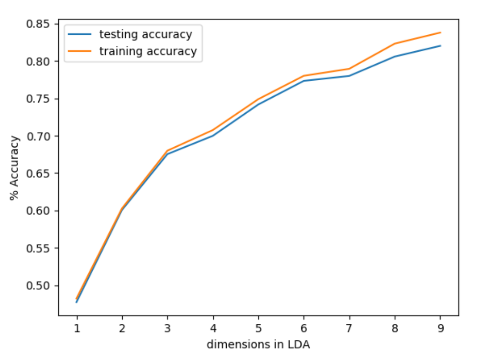
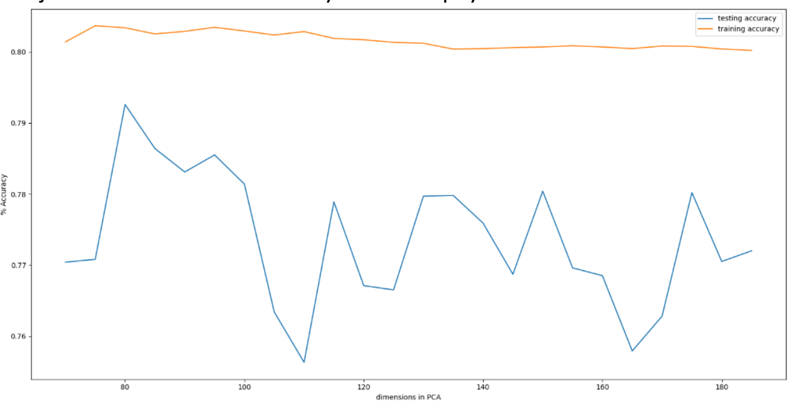
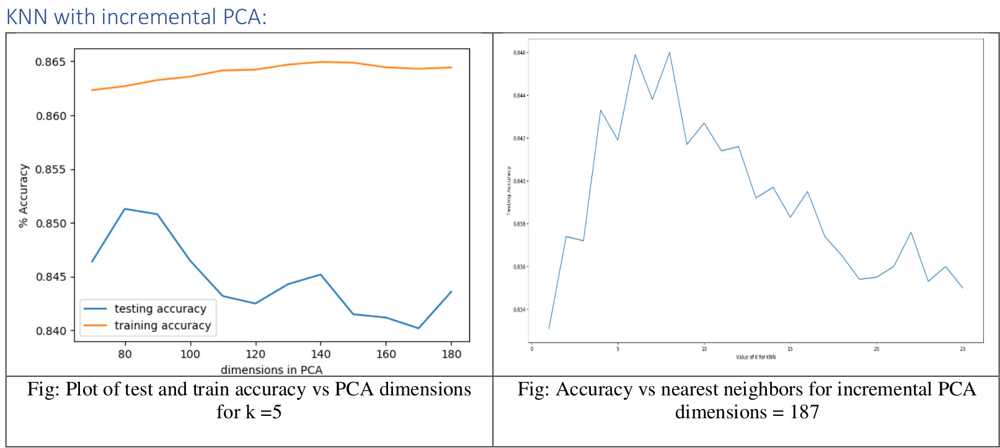
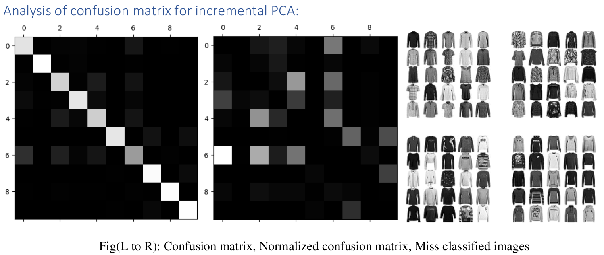

[](https://opensource.org/licenses/MIT)
[](https://github.com/psf/black)


## Table of Contents
- [CMSC828C-project-1](#CMSC828C-project-1)
  * [Introduction](#Introduction)
  * [Labels](#Labels)
  * [Examples](#examples)
  * [Licence](#Licence)
  * [Virtual Environment](#Virtual Environment)
  * [Dependency Installation](#Dependency installation)
  * [Dataset](#Dataset)
  * [Author](#Author)
  * [References](#References)
    

# CMSC828C-project-1

Implementated Maximum Likelihood Estimation (MLE) with Gaussian assumption followed by Bayes rule for classification. Also implemented the same after applying PCA and LDA for dimensionality reduction

# Introduction

Each image is 28 pixels in height and 28 pixels in width, for a total of 784 pixels in total. Each pixel has a single pixel-value associated with it, indicating the lightness or darkness of that pixel, with higher numbers meaning darker. This pixel-value is an integer between 0 and 255. The training and test data sets have 785 columns. The first column consists of the class labels (see above), and represents the article of clothing. The rest of the columns contain the pixel-values of the associated image.

## Labels

Each training and test example is assigned to one of the following labels:

| Label | Description |
| --- | --- |
| 0 | T-shirt/top |
| 1 | Trouser |
| 2 | Pullover |
| 3 | Dress |
| 4 | Coat |
| 5 | Sandal |
| 6 | Shirt |
| 7 | Sneaker |
| 8 | Bag |
| 9 | Ankle boot | 

## License
```
MIT License

Copyright (c) 2018 Aditya Vaishampayan

Permission is hereby granted, free of charge, to any person obtaining a copy
of this software and associated documentation files (the "Software"), to deal
in the Software without restriction, including without limitation the rights
to use, copy, modify, merge, publish, distribute, sublicense, and/or sell
copies of the Software, and to permit persons to whom the Software is
furnished to do so, subject to the following conditions:

The above copyright notice and this permission notice shall be included in all
copies or substantial portions of the Software.

THE SOFTWARE IS PROVIDED "AS IS", WITHOUT WARRANTY OF ANY KIND, EXPRESS OR
IMPLIED, INCLUDING BUT NOT LIMITED TO THE WARRANTIES OF MERCHANTABILITY,
FITNESS FOR A PARTICULAR PURPOSE AND NONINFRINGEMENT. IN NO EVENT SHALL THE
AUTHORS OR COPYRIGHT HOLDERS BE LIABLE FOR ANY CLAIM, DAMAGES OR OTHER
LIABILITY, WHETHER IN AN ACTION OF CONTRACT, TORT OR OTHERWISE, ARISING FROM,
OUT OF OR IN CONNECTION WITH THE SOFTWARE OR THE USE OR OTHER DEALINGS IN THE
SOFTWARE.
```

## Virtual Environment

### Installing a Virtual Environment
The virtualenv package is required to create virtual environments. You can install it with pip:
```
pip install virtualenv
```

### Create the virtual environment
To create a virtual environment, you must specify a path. For example to create one in the local directory called ‘mypython’, type the following:
```
virtualenv mypython
```

### Activate the virtual environment
You can activate the python environment by running the following command:

Mac OS / Linux
```
source mypython/bin/activate
```

You should see the name of your virtual environment in brackets on your terminal line e.g. (mypython).

Any python commands you use will now work with your virtual environment

### Deactivate the virtual environment
To decativate the virtual environment and use your original Python environment, simply type ‘deactivate’.
```
deactivate
```


## Dependency Installation

Once in the virtual environemnet:

* To clone this repo in your virtual environment:
```
git clone https://github.com/adityavaishampayan/CMSC828C-project1.git
```
* cd to the CMSC828C-project1 folder and then install the requirements file 
```
pip install -r requirements.txt
```
This will install all the required libraries to run this project

# Dataset

This project required the Fashion_MNIST dataset to run. The data has already be added in this repo.

However to clone the original repository one can use the following command:
```
git clone git@github.com:zalandoresearch/fashion-mnist.git
```

Fashion-MNIST is a dataset of Zalando's article images—consisting of a training set of 60,000 examples and a test set of 10,000 examples. Each example is a 28x28 grayscale image, associated with a label from 10 classes. Zalando intends Fashion-MNIST to serve as a direct drop-in replacement for the original MNIST dataset for benchmarking machine learning algorithms. It shares the same image size and structure of training and testing splits.

## Output Results

### Bayes Classifier with LDA
||
|:--:|
| *Fig: Train and test accuracy vs LDA dimensions* |

### Bayes Classifier with Incremental PCA
||
|:--:|
| *Fig: Plot of test and train accuracy vs incremental PCA dimensions* |

### KNN with incremental PCA
||
|:--:|

### Analysis of confusion matrix for incremental PCA:
||
|:--:|
| *Fig(L to R): Confusion matrix, Normalized confusion matrix, Miss classified images* |

## Author

* **Aditya Vaishampayan** - [AdityaVaishampayan](https://github.com/adityavaishampayan)


## References
[1] [sklearn.LinearDiscriminantAnalysis](http://scikit-learn.org/stable/modules/generated/sklearn.discriminant_analysis.LinearDiscriminantAnalysis.html#sklearn.discriminant_analysis.LinearDiscriminantAnalysis.fit)  
[2] [sklearn.PCA](http://scikit-learn.org/stable/modules/generated/sklearn.decomposition.PCA.html)  
[3] [sklearn.GaussianNB](http://scikit-learn.org/stable/modules/naive_bayes.html#gaussian-naive-bayes)  
[4] [How to Get 97% on MNIST with KNN](https://steven.codes/blog/ml/how-to-get-97-percent-on-MNIST-with-KNN/)  
[5] [fit() and transform() methods](https://stackoverflow.com/questions/23838056/what-is-the-difference-between-transform-and-fit-transform-in-sklearn)  
[6] [PCA returned negative values](https://stackoverflow.com/questions/34725726/is-it-possible-apply-pca-on-any-text-classification)  
[7] [tutorial on Bayes basic](https://lazyprogrammer.me/bayes-classifier-and-naive-bayes-tutorial-using/)  
[8] [Naive Bayes on MNIST dataset](https://github.com/bikz05/ipython-notebooks/blob/master/machine-learning/naive-bayes-mnist-sklearn.ipynb)  
[9] [MNIST HW u-brown](http://cs.brown.edu/courses/csci1950-f/fall2009/docs/wk04.pdf)
